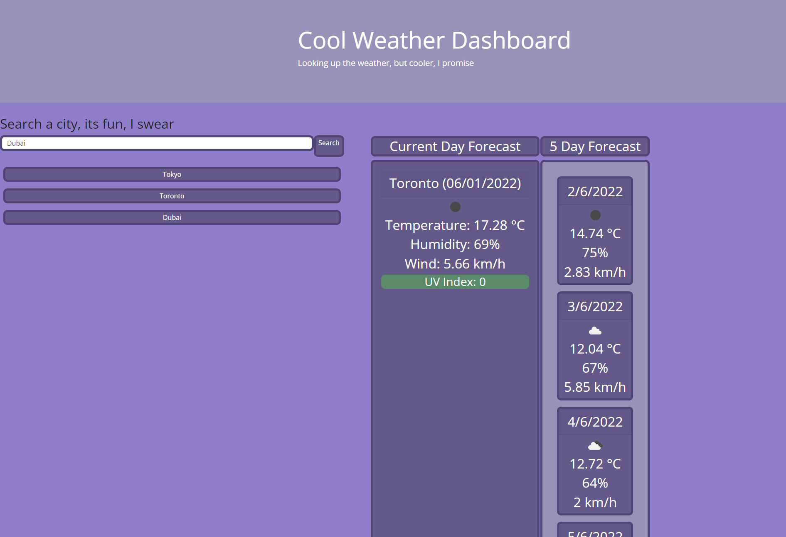

# Module-6-Weather-Dashboard

This repository is my fifth challenge of many to complete within the UofT coding bootcamp I'm taking part of. 
The assignment is to create a Work Day Scheduler to meet the assignment's Acceptance Criteria.
The first part of this is the User Story which is as follows:

## User Story

AS AN employee with a busy schedule
I WANT to add important events to a daily planner
SO THAT I can manage my time effectively

## Acceptance Criteria

The Acceptance Criteria is as follows:

GIVEN I am using a daily planner to create a schedule
WHEN I open the planner
THEN the current day is displayed at the top of the calendar
WHEN I scroll down
THEN I am presented with time blocks for standard business hours
WHEN I view the time blocks for that day
THEN each time block is color-coded to indicate whether it is in the past, present, or future
WHEN I click into a time block
THEN I can enter an event
WHEN I click the save button for that time block
THEN the text for that event is saved in local storage
WHEN I refresh the page
THEN the saved events persist

## To Put It Simply

The assignment is to create a Work Day Scheduler which tracks the current date, stores and grabs description data from local storage , and changes the colors of the time blocks based on if they are in the past, present, or future, looking something like this

## Link To Deployed Application
https://benbasic.github.io/Module-6-Weather-Dashboard/

